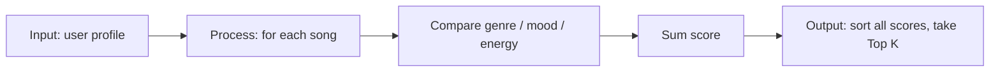
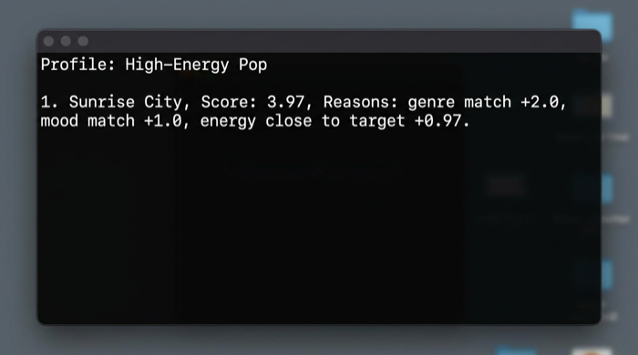
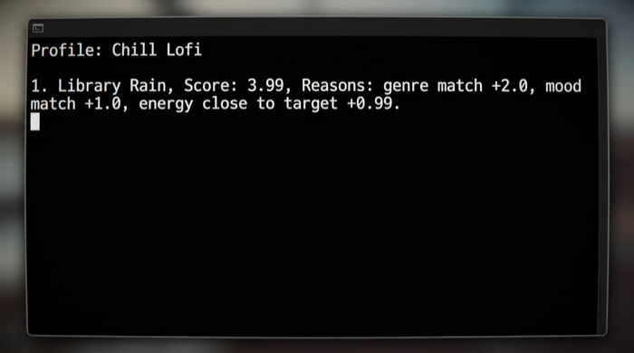
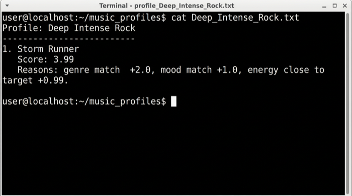
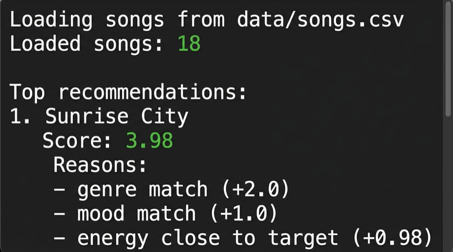

# Music Recommender Simulation

## Project Summary

This project simulates a **content-based** music recommender: each row in `data/songs.csv` is a song with tags and numeric audio-style features; a **user profile** states favorite genre, favorite mood, and target energy. The program scores every song with an explicit **point recipe**, sorts descending, and returns the top **k** tracks. It is a small, transparent classroom model—not a production recommender.

---

## How The System Works

### Step 1 — Data (`data/songs.csv`)

**Columns (headers unchanged):** `id`, `title`, `artist`, `genre`, `mood`, `energy`, `tempo_bpm`, `valence`, `danceability`, `acousticness`.

**Catalog size:** the starter **10** tracks were extended with **8** additional songs (**18** total) so recommendations are less trivial. New rows add variety across **genres** (e.g. electronic, classical, indie, rock, lofi) and **moods** (e.g. aggressive, calm, romantic, dreamy, nostalgic, dark), not only pop.

**Extra numeric fields (optional / future):** `valence`, `danceability`, and `acousticness` describe vibe more finely (happy vs sad, dance vs sit, acoustic vs produced). They are **stored in the CSV** for experiments; the **default scorer in code** still uses only `genre`, `mood`, and `energy` unless you extend it.

### Real-world recommenders vs this project

| Idea | What it means |
|------|----------------|
| **Collaborative filtering** | Uses **what other users did**: likes, skips, playlists, “people who liked X also liked Y.” |
| **Content-based filtering** | Uses **what each song is** and matches it to a **user taste profile**. This repo uses this approach. |

**Data real systems often use**

- **User behavior:** likes, skips, playlists, listen time  
- **Content features:** genre, mood, energy, tempo (and often danceability / valence–like signals)

### Step 2 — User profile

The recommender compares each song to a **fixed preference record**. `src/main.py` defines **three** stress-test profiles (**High-Energy Pop**, **Chill Lofi**, **Deep Intense Rock**); each is passed as `genre` / `mood` / `energy` (see `score_song` aliases). Example single profile:

```python
user_profile = {
    "favorite_genre": "pop",
    "favorite_mood": "happy",
    "target_energy": 0.8,
}
```

**Discriminability:** this profile is not “everything is 0.5.” It separates **high-energy happy pop** from **chill lofi**, **dark classical**, or **aggressive electronic** because genre/mood must match for big points and energy must sit near `0.8`.

Optional future keys (not scored by default): `target_danceability`, `target_acousticness` aligned with CSV columns.

### Step 3 — Algorithm recipe (scoring + ranking)

**One sentence:** The recommender awards points for genre matches, mood matches, and energy similarity, then ranks songs from highest to lowest score.

**Categorical rules (match = full credit, no match = 0):**

| Rule | Points |
|------|--------|
| `genre` equals user’s favorite genre | **+2.0** |
| `mood` equals user’s favorite mood | **+1.0** |

**Numeric rule (not “higher is always better”):** energy similarity in \[0, 1\]:

`energy_similarity = max(0, 1 - |song.energy - user.target_energy|)`  
This value is **added** to the total (so it can contribute up to **+1.0**).

**Total score for one song:**

`score = (2.0 if genre match else 0) + (1.0 if mood match else 0) + energy_similarity`

**Ranking:** compute `score` for **every** song → sort **descending** → take **top k**.

Constants in code: `POINTS_GENRE_MATCH`, `POINTS_MOOD_MATCH` in `src/recommender.py`.

**Why genre has the largest fixed weight:** a genre mismatch usually feels “wrong” before mood or a small energy gap; +2 vs +1 encodes that priority in a simple, explainable way.

### Step 4 — Input → Process → Output (flow)



- **Input:** favorite genre, favorite mood, target energy.  
- **Process:** loop over all rows in `songs.csv`, compute score per song.  
- **Output:** ordered list of best-matching songs (default top 5).

### Bias and limitations (design-level)

This system may **over-prioritize genre** and **under-recommend** tracks that match mood and energy but live in a different genre label. Exact string matches ignore “close” genres (e.g. `indie pop` vs `pop`). Recommendations can become **repetitive** (same genre/mood cluster) and contribute to a **filter bubble** if the profile never changes. Mood-only matches lose to genre-first scoring, which can feel unfair to niche artists. These issues are acceptable for a teaching simulation but would need richer features or learning in a real product.

---

## Features

### Song features (from `songs.csv`)

| Feature | Role in this project |
|---------|----------------------|
| `genre` | Scoring: +2 if it matches the user’s favorite genre. |
| `mood` | Scoring: +1 if it matches the user’s favorite mood. |
| `energy` | Scoring: add \[0,1\] similarity to target energy. |
| `tempo_bpm` | In data; optional extension (not in default score). |
| `valence`, `danceability`, `acousticness` | In data; optional richer “vibe” (not in default score). |

### User profile

**Concept names (course keywords ↔ this repo)**

| Course keyword | Implemented as |
|----------------|----------------|
| `preferred_genres` | One label: `favorite_genre` / dict key `genre` (multi-genre would be a natural extension). |
| `preferred_moods` | One label: `favorite_mood` / dict key `mood`. |
| `preferred_energy` | `target_energy` / dict key `energy`. |

**Object API (`UserProfile` in code)**

| Field | Meaning |
|-------|---------|
| `favorite_genre` | Preferred genre label (must match `genre` text when scoring). |
| `favorite_mood` | Preferred mood label. |
| `target_energy` | Desired energy in \[0, 1\]. |
| `likes_acoustic` | Reserved for extensions; not in the default score. |

**Dictionary API (`user_prefs` / `score_song`)**

| Key | Meaning |
|-----|---------|
| `genre` | Preferred genre (aliases: `favorite_genre`). |
| `mood` | Preferred mood (aliases: `favorite_mood`). |
| `energy` | Target energy (aliases: `target_energy`). |

---

## Design checklist (this phase)

- [x] Opened `songs.csv` and documented fields  
- [x] Added **8** new songs (same headers), broader genres/moods  
- [x] Noted optional numeric features (`valence`, `danceability`, `acousticness`) for richer vibe  
- [x] Defined a concrete, discriminative `user_profile` in `main.py`  
- [x] Documented scoring (+2 / +1 / energy similarity), sorting, Top K  
- [x] Flow diagram (Mermaid) and **bias** notes in this README  

---

## Evaluation & stress tests

`src/main.py` runs **three** contrasting profiles back-to-back, then a **weight-shift experiment** on the *Chill Lofi* user (default scoring vs **energy emphasis**: genre **+1**, mood **+1**, energy similarity scaled **×2**). Full console capture: [`docs/eval-output-full.txt`](docs/eval-output-full.txt).

### Terminal-style captures (one per profile)

These illustrate **title**, **score**, and **reasons** for the **#1** song under each persona. For course submission you may replace them with your own terminal screenshots.

**High-Energy Pop** (`pop` / `happy` / high energy)



**Chill Lofi** (`lofi` / `chill` / low energy)



**Deep Intense Rock** (`rock` / `intense` / high energy)



### What we looked for

- **Different profiles → different tops:** e.g. *Sunrise City* leads for pop/happy; *Library Rain* for lofi/chill; *Storm Runner* for rock/intense.  
- **Label bias:** exact **genre** strings dominate; e.g. *indie pop* does not count as *pop* without changing the data.  
- **Experiment:** doubling energy weight did **not** change the **order** of the Chill Lofi top five in our run—genre+mood matches still won. See **[`model_card.md`](model_card.md)** §7 and **[`reflection.md`](reflection.md)** for narrative analysis.

---

## Getting Started

### Setup

1. Create a virtual environment (optional but recommended):

   ```bash
   python -m venv .venv
   source .venv/bin/activate      # Mac or Linux
   .venv\Scripts\activate         # Windows
   ```

2. Install dependencies:

   ```bash
   pip install -r requirements.txt
   ```

3. Run the app (from repository root):

   ```bash
   python -m src.main
   ```

### Running Tests

```bash
pytest
```

You can add more tests in `tests/test_recommender.py`.

### CLI sample output

From the repository root, run:

```bash
python -m src.main
```

You should see `Loading songs from ...`, **`Loaded songs: 18`** (or your catalog size), then **numbered** recommendations with **Score** and **Reasons** bullets (genre / mood / energy), for example:



Text transcript (same run, for copy-paste / accessibility):

```
Loading songs from data/songs.csv...
Loaded songs: 18

Top recommendations:

1. Sunrise City
   Score: 3.98
   Reasons:
   - genre match (+2.0)
   - mood match (+1.0)
   - energy close to target (+0.98)

2. Gym Hero
   Score: 2.87
   Reasons:
   - genre match (+2.0)
   - energy close to target (+0.87)

3. Rooftop Lights
   Score: 1.96
   Reasons:
   - mood match (+1.0)
   - energy close to target (+0.96)

4. Night Drive Loop
   Score: 0.95
   Reasons:
   - energy close to target (+0.95)

5. Neon Pulse
   Score: 0.92
   Reasons:
   - energy close to target (+0.92)
```

A plain-text copy is also saved as [`docs/cli-output-sample.txt`](docs/cli-output-sample.txt). For grading, you may replace the image with your own terminal screenshot if your instructor prefers a real capture.

---

## Experiments You Tried

Use this section to document experiments you ran. For example:

- What happened when you changed genre points from **+2** to a smaller value (mood becomes relatively stronger)  
- What happened when you added `tempo_bpm` or `valence` to the score  
- How your system behaved for different types of users  

---

## Limitations and Risks

Summarize some limitations of your recommender.

Examples:

- It only works on a tiny catalog  
- It does not understand lyrics or language  
- It might over-favor one genre or mood  

You will go deeper on this in your model card.

---

## Reflection

Read **[`model_card.md`](model_card.md)** (limitations, evaluation) and **[`reflection.md`](reflection.md)** (pairwise profile comparison).

Write 1 to 2 paragraphs here about what you learned (optional course paste):

- about how recommenders turn data into predictions  
- about where bias or unfairness could show up in systems like this  
